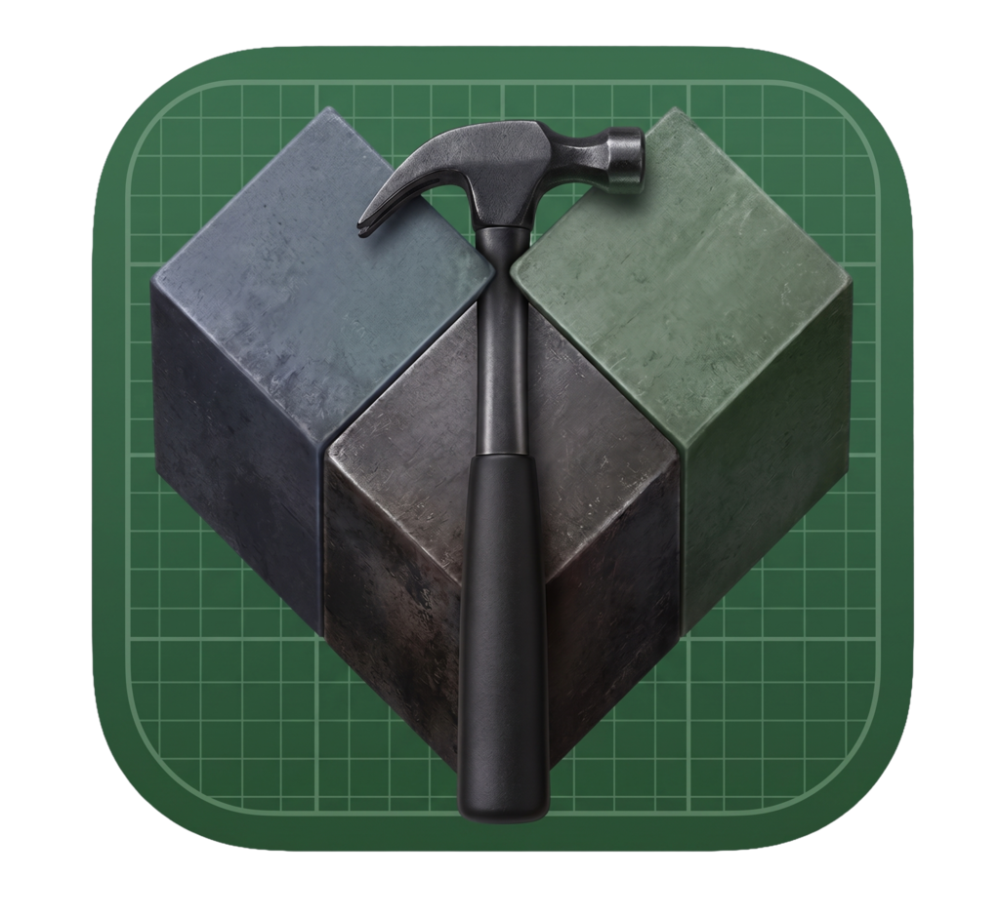

<p align="center">
  
</p>

# XcodeBazelMCP

A Model Context Protocol (MCP) server and CLI for Bazel-based Apple platform development. Ships 112 tools across 19 workflow categories covering iOS, macOS, tvOS, watchOS, visionOS, and Swift Package Manager.

## What It Provides

- **Build & Run** — Build, install, launch, and stop iOS/macOS apps on simulators and physical devices.
- **Test & Coverage** — Run unit/UI/build tests with filtering, streaming output, and code coverage.
- **Simulator Management** — Boot, shutdown, erase, configure location/appearance/status bar.
- **Physical Device** — Full device lifecycle via `xcrun devicectl`: list, pair, install, launch, terminate, screenshot, log capture.
- **LLDB Debugging** — Attach to simulator or device processes, set breakpoints, inspect variables, step through code.
- **UI Automation** — Tap, swipe, type, drag, pinch, and inspect accessibility trees on simulators (via IDB or CGEvent fallback).
- **Multi-platform** — tvOS, watchOS, visionOS build/run/test/discover targets.
- **Swift Package Manager** — Build, test, run, clean, resolve, dump, and init Swift packages.
- **Project Discovery** — Query the Bazel build graph, discover targets, inspect dependencies.
- **Scaffolding** — Generate new Bazel projects from templates (ios_app, macos_app, etc.).
- **Session & Config** — Workspace management, build profiles, defaults, health checks.
- **Background Daemon** — Per-workspace daemon for stateful operations.
- **Self-update** — Check for and install updates.

## Requirements

- macOS with Xcode installed
- Node.js 18+
- Bazel or Bazelisk on `PATH`
- A Bazel workspace (set via `BAZEL_IOS_WORKSPACE`, config file, or `set_workspace` tool)

### Optional (for device screenshots & logs on iOS 17+)

- `pymobiledevice3` — `pip3 install pymobiledevice3`
- For screenshots: `sudo pymobiledevice3 remote tunneld` running in background
- For logs: pymobiledevice3 is tried first automatically, falls back to `idevicesyslog`

## Setup

```sh
npm install
npm run build
```

### Quick start (interactive)

```sh
xcodebazelmcp setup
```

### Install agent skills (Cursor / Codex)

```sh
xcodebazelmcp init
```

## MCP Configuration

```json
{
  "mcpServers": {
    "XcodeBazelMCP": {
      "command": "node",
      "args": ["/path/to/XcodeBazelMCP/dist/cli.js", "mcp"],
      "env": {
        "BAZEL_IOS_WORKSPACE": "/path/to/your/ios-workspace"
      }
    }
  }
}
```

Or with workspace flag:

```sh
xcodebazelmcp mcp --workspace /path/to/your/ios-workspace
```

## Working with Workspaces

XcodeBazelMCP needs to know which Bazel workspace to operate on. There are several ways to set it, in order of precedence:

1. **MCP tool at runtime** — `bazel_ios_set_workspace` (or CLI `set-defaults --target //app:app`)
2. **CLI flag** — `xcodebazelmcp mcp --workspace /path/to/workspace`
3. **Environment variable** — `BAZEL_IOS_WORKSPACE=/path/to/workspace`
4. **Config file** — `.xcodebazelmcp/config.yaml` in the workspace root (supports profiles)
5. **Fallback** — `process.cwd()`

For multi-workspace setups, use **profiles** in `config.yaml`:

```yaml
profiles:
  app:
    target: '//app:app'
    platform: simulator
    buildMode: debug
  mac:
    target: '//mac:mac'
    platform: macos
```

Then switch at runtime: `xcodebazelmcp set-defaults --profile app`

## CLI Examples

```sh
# Health check
xcodebazelmcp doctor

# Discover & query
xcodebazelmcp discover --scope //Apps/... --kind apps
xcodebazelmcp query 'deps(//app:app)'

# Build & run (simulator)
xcodebazelmcp build //app:app --debug --simulator
xcodebazelmcp run //app:app --simulator-name "iPhone 16 Pro"

# Build & run (device)
xcodebazelmcp device-run //app:app --device-name "iPhone"
xcodebazelmcp device-screenshot output.png --device-name "iPhone"
xcodebazelmcp device-log-start --device-name "iPhone"

# Test
xcodebazelmcp test //tests:UnitTests --filter "SomeTest/testCase" --stream

# macOS
xcodebazelmcp macos-build //mac:mac --debug
xcodebazelmcp macos-run //mac:mac

# Swift Package Manager
xcodebazelmcp spm-build --path ./MyPackage
xcodebazelmcp spm-test --filter "MyTests/testExample"

# Scaffold
xcodebazelmcp new ios_app MyNewApp --bundle-id com.example.MyNewApp

# Config
xcodebazelmcp defaults
xcodebazelmcp set-defaults --target //app:app --simulator-name "iPhone 16 Pro"
xcodebazelmcp workflows
```

## Workflow Categories (112 tools)

Workflows control which tools are advertised to MCP clients. Smart defaults enable the most common workflows; use `toggle-workflow` to customize.

| Category          | Tools | Description                                           |
| ----------------- | ----- | ----------------------------------------------------- |
| **build**         | 2     | Build iOS targets for simulator or device             |
| **test**          | 2     | Run iOS tests with optional coverage                  |
| **simulator**     | 10    | Manage simulator lifecycle and settings               |
| **app_lifecycle** | 5     | Install, launch, stop apps on simulator               |
| **capture**       | 5     | Screenshot, video recording, log capture (simulator)  |
| **ui_automation** | 9     | Tap, swipe, type, drag, accessibility snapshot        |
| **deep_links**    | 2     | Open URLs and send push notifications                 |
| **device**        | 13    | Physical device build, deploy, test, screenshot, logs |
| **lldb**          | 10    | LLDB debugger: breakpoints, variables, stepping       |
| **macos**         | 13    | macOS build, run, test, discover                      |
| **tvos**          | 4     | tvOS build, run, test, discover                       |
| **watchos**       | 4     | watchOS build, run, test, discover                    |
| **visionos**      | 4     | visionOS build, run, test, discover                   |
| **spm**           | 7     | Swift Package Manager operations                      |
| **project**       | 6     | Target discovery, query, deps, rdeps                  |
| **scaffold**      | 2     | Generate new Bazel projects                           |
| **session**       | 7     | Workspace, defaults, profiles, health                 |
| **daemon**        | 3     | Background daemon management                          |
| **update**        | 2     | Self-update and version check                         |

## iOS 17+ Device Notes

Apple replaced `lockdownd`/`usbmuxd` with CoreDevice (`remoted`) starting in iOS 17 / macOS 15. This means:

- **`xcrun devicectl`** is the only reliable CLI for device operations (list, install, launch, terminate).
- **Screenshots** require `pymobiledevice3` with `tunneld` running — no `devicectl` screenshot subcommand exists.
- **Logs** use `pymobiledevice3 syslog live` (automatic fallback to `idevicesyslog` for older devices).
- **Process termination** uses a two-step PID lookup since `devicectl` doesn't expose `bundleIdentifier` in process listings.

See [docs/device-support.md](docs/device-support.md) for full details.

## Development

```sh
npm run build     # Build dist/
npm test          # Run tests (vitest)
npm run lint      # ESLint
```

## Notes

The server launches Bazel with `spawn`, not a shell. Extra flags are passed as argv entries so commands are reproducible and avoid shell interpolation.
